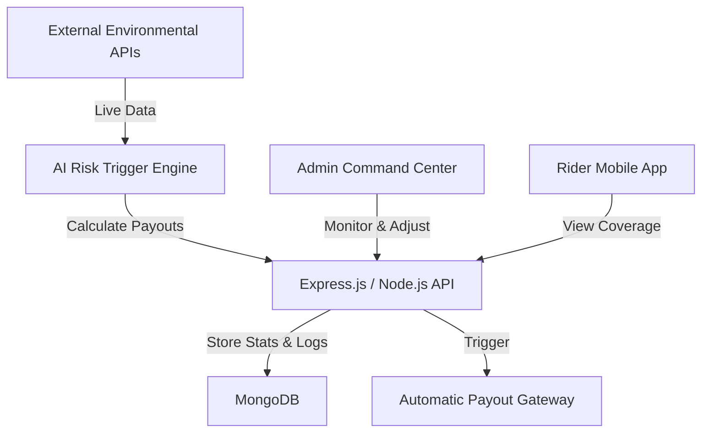

# GigShield AI – AI-Powered Parametric Micro-Insurance

**GigShield AI** is a cutting-edge InsurTech platform designed to provide financial resilience for gig economy workers (Swiggy, Zomato, Uber, etc.). By leveraging real-time environmental data and AI-driven risk assessment, the platform automatically detects income-threatening disruptions and triggers near-instant payouts—**no manual claims required.**

---

## 🚀 The Mission
Traditional insurance is too slow and rigid for the gig economy. Gig workers lose daily income due to heavy rain, extreme heat, or traffic gridlock. **GigShield AI** fills this gap with a **parametric model**: if a predefined weather or traffic threshold is met, the "Shield" activates and the rider gets paid.

---

## ✨ Key Features

### 🛠️ Advanced Admin Command Center
A professional-grade "Mission Control" for insurance providers:
*   **Market Fleet Heatmap**: Real-time visualization of 100+ riders across Chennai using **Leaflet.js**, featuring live zone-density radar and high-risk ping tracking.
*   **Dynamic Pricing Engine**: A real-time "Pricing Dial" allow admins to adjust city-wide risk multipliers based on incoming weather forecasts.
*   **Manual Payout Overrides**: A streamlined "Claims & Overrides" queue for handling edge-case disputes or manual approvals.
*   **Deep Fraud Investigation**: AI-driven "Audit Modals" that present anomaly logs (GPS spoofing, device mismatch) and allow for one-click account suspension.
*   **System Health Monitor**: Live telemetry for external API dependencies (OpenWeatherMap, Google Maps, Payment Gateways).

### 🛡️ Futuristic Rider Experience
*   **Glassmorphism Dashboard**: A premium, high-performance UI showing active policy status, real-time risk scores, and payout history.
*   **Automated Payouts**: Parametric triggers ensure that when "Moderate Rain" turns to "Severe Flood," the payout is initialized automatically.
*   **Secure Onboarding**: A high-end Auth system featuring animated "Security Scan" effects and role-based access.

---

## 💻 Tech Stack

**Frontend:**
*   **React 18** (Vite-powered)
*   **Leaflet.js** (Reactive Mapping & Heatmaps)
*   **Recharts** (Financial Trend Analysis)
*   **Lucide / React-Icons** (Iconography)
*   **Vanilla CSS** (Custom Glassmorphic Design System)

**Backend:**
*   **Node.js & Express.js**
*   **MongoDB & Mongoose** (NoSQL Database)
*   **JWT & Bcrypt** (Secure Role-Based Auth)

---

## 📊 System Architecture



---

## 🛠️ Installation & Setup

### 1. Clone the Repository
```bash
git clone https://github.com/abhinavshankar17/GigShield-AI.git
cd GigShield-AI
```

### 2. Backend Setup
```bash
cd server
npm install
# Create a .env file with MONGO_URI and JWT_SECRET
npm run dev
```

### 3. Seed the Database
Populate the system with 100+ riders, active policies, and sample claims:
```bash
node src/seed.js
```

### 4. Frontend Setup
```bash
cd ../client
npm install
npm run dev
```

---

## 🛡️ AI Core & Fraud Detection
GigShield doesn't just pay out; it protects the reserve pool using:
*   **Behavioral Auditing**: Patterns that deviate from standard delivery routes flag high fraud scores.
*   **GPS Variance Checking**: AI detects "GPS Jumps" or spoofed locations during active disruption events.
*   **Risk Multipliers**: Premiums scale dynamically based on real-time disruption data, ensuring long-term financial sustainability.

---

## 📈 Future Roadmap
*   **L2 Integration**: Moving the claim settlements to a blockchain-based smart contract for 100% transparency.
*   **Multi-City Expansion**: Expanding beyond Chennai to all tier-1 metro cities via automated zone-mapping.
*   **Predictive Weather ML**: Training local models to forecast rain-flooding patterns 2 hours before they occur.

---

*Building financial resilience for the workforce powering the digital economy.*
**GigShield AI – The Shield That Never Sleeps.**
